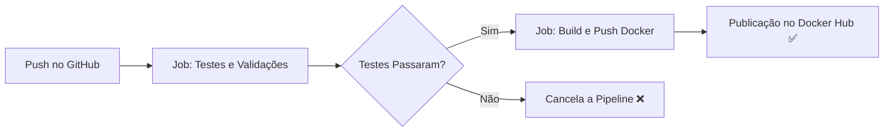

# 🎂 Projeto Bolo — Integração e Entrega Contínua (CI/CD)

Projeto prático desenvolvido para a disciplina de **Integração e Entrega Contínua (IEC)**. Trata-se de uma aplicação web estática containerizada com **Docker** e servida pelo servidor web **Nginx Alpine**, integrada a uma esteira automatizada de CI/CD via **GitHub Actions** com publicação automática no **Docker Hub**.

---

## 🛠️ Tecnologias Utilizadas

- **HTML5 & CSS3:** Interface e estilização da página.
- **Docker & Nginx Alpine:** Containerização leve e de alta performance.
- **GitHub Actions:** Orquestração da esteira de CI/CD (Testes, Build e Deploy).
- **Docker Hub:** Registro público de imagens de containers.

---

## 📁 Estrutura do Projeto

```text
bolo/
├── .github/
│   └── workflows/
│       └── pipeline.yml    # Pipeline de CI/CD (Testes e Build/Push)
├── img/
│   └── bolo.jpg            # Imagem do bolo
├── .dockerignore           # Arquivos ignorados no build da imagem
├── Dockerfile              # Configuração do container Nginx
├── index.html              # Página principal
├── style.css               # Folha de estilos
└── README.md               # Documentação do projeto
```

---

## ⚙️ Pipeline de CI/CD (GitHub Actions)

A pipeline é acionada automaticamente a cada `push` ou `pull_request` na branch `main`:



### Etapas da Pipeline:
1. **Job `test` (Testes e Validações):**
   - Valida a presença de todos os arquivos essenciais (`index.html`, `style.css`, `img/bolo.jpg`).
   - Executa análise estática e sintática do HTML utilizando **HTMLHint**.
2. **Job `build` (Build & Deploy):**
   - Autentica no Docker Hub com credenciais seguras (*GitHub Secrets*).
   - Realiza o build da imagem Docker.
   - Publica a imagem no repositório público com a tag `latest`.

---

## 🚀 Como Executar o Projeto

### 1. Rodar direto pelo Docker Hub (Mais rápido)

Você não precisa clonar o projeto para testar. Basta ter o Docker instalado e rodar:

```bash
docker run -d -p 8081:80 --name site-bolo gabriel9648/bolo-iec:latest
```

Acesse no navegador:
👉 **[http://localhost:8081](http://localhost:8081)**

---

### 2. Rodar e Construir Localmente

Caso queira clonar e fazer o build local:

```bash
# 1. Clone o repositório
git clone https://github.com/GabrieldeMoura9648/bolo.git

# 2. Acesse a pasta
cd bolo

# 3. Construa a imagem Docker
docker build -t bolo-iec .

# 4. Execute o container
docker run -d -p 8081:80 --name site-bolo bolo-iec
```

---

## 🔗 Links Úteis

- **Repositório GitHub:** [github.com/GabrieldeMoura9648/bolo](https://github.com/GabrieldeMoura9648/bolo)
- **Imagem no Docker Hub:** [hub.docker.com/r/gabriel9648/bolo-iec](https://hub.docker.com/r/gabriel9648/bolo-iec)
